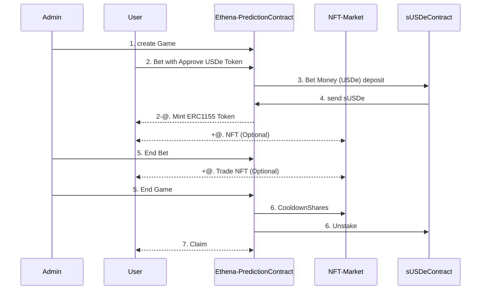

# ETHENA Predcition
Play stably in an extreme and optimistic prediction space.

#### [Platform]() | [Demo Video]() | [Pitchdeck]()

## Motivation
> **A New Approach to Prediction Markets**
  - Rather than solving existing problems or focusing on specific limitations of current prediction markets, we are driven by the opportunity to explore and expand the marketability of this space.
  - Our aim is to innovate within the prediction market domain by leveraging emerging trends and technologies.

> **Inspired by Polymarket, Enhanced by Ethena**
  - Inspired by popular and trendy services like Polymarket, we are developing a prediction market within the **`Ethena ecosystem`**.
  - By incorporating various advanced technologies, we aim to differentiate our platform and offer users a unique experience.

> **Delivering an Advanced and Enjoyable Service**
  - Through **`Ethena Prediction`**, we showcase the technical capabilities of the Ethena ecosystem.
  - While maintaining familiar elements, we integrate diverse Web3 technologies to provide a more engaging and advanced prediction market service that sets us apart from existing solutions.

## Features
#### **1. USDe-based Payment and Reward System (Ethena)**  
- **Description**: Maps USDe to **sUSDe tokens** on a 1:1 basis for staking and payments within the platform.  
- **Effect**:  
  - Enhances the value of prediction options and fosters **P2P liquidity** through transactions.  
  - Increases overall platform transaction volume and user engagement.  
- **Additional Benefits**:  
  - **sUSDe's annualized return of 16.8%** maximizes deposit and transaction incentives.  
  - The high reward structure mitigates risks for long-term predictions, encouraging user participation and boosting market liquidity.  

---

#### **2. ERC-1155 for Market Diversity**  
- **Description**: Employs **ERC-1155 tokens** to represent prediction market positions, enabling users to manage multiple assets within a single contract.  
- **Effect**:  
  - Reduces gas fees and improves efficiency for creating, holding, and trading diverse prediction outcomes.  
  - Enhances user experience by simplifying asset management across varied market predictions.  

---

#### **3. Multi-chain Support (LayerZero)**  
- **Description**: Integrates **LayerZero protocol** to enable USDe usage across multiple blockchain networks.  
- **Effect**:  
  - Offers seamless multi-chain functionality, expanding access to users across various ecosystems.  
  - Ensures interoperability for prediction market operations on diverse blockchain networks.  

---

#### **4. Real-time Data Insights via Subgraphs (Goldsky)**  
- **Description**: Utilizes **Goldsky-powered subgraphs** to provide real-time updates on ERC standard transactions and data.  
- **Effect**:  
  - Delivers accurate, real-time information for users and enhances the transparency of prediction markets.  
  - Enables seamless monitoring and analytics for active market participants.  

### Smart Contract
#### [Ethena](https://github.com/hackathemy/ethena-prediction/blob/main/script/EthenaPredict.s.sol) | [Goldsky]() | [LayerZero]()

**Ethena**
While developing our betting system, we identified a significant inefficiency: funds remained idle during the betting period. To address this issue, we integrated Athena Network's USDE into our solution.

The betting process is structured as follows:
1. Betting Participation: When users place a bet, their funds are deposited and converted into sUSDE, which is staked.
2. Staking Period: During the betting period, the staked funds generate interest.
3. Bet Settlement: Once the betting round concludes, users can unstake their funds to receive their original betting amount along with the accrued interest.

This approach not only optimizes fund utilization but also creates additional economic value. Participants benefit from both the excitement of betting and the financial advantage of earning interest on their funds.

**Goldsky**


## Structure




## Target
1. **Extreme Users**  
   - **Details:** Users who enjoy exploring new things.  
   - **Description:** A fun prediction platform designed for adventurous commercial users who fearlessly explore new Web3 ecosystem services and enjoy extreme and entertaining experiences.  

2. **Traders**  
   - **Details:** Specialists in long/short positions and investments.  
   - **Description:** A prediction trading space tailored for traders who analyze charts of various coins and invest in existing exchanges (futures, spot, fiat currencies). It also caters to users looking to trade new products in Web3 ecosystems like DeFi, PumpFun, and PolyMarket to generate profits.  

3. **Ethena Users**  
   - **Details:** Existing users of the Ethena ecosystem.  
   - **Description:** A prediction trading platform that increases liquidity by leveraging the existing Ethena ecosystem. It provides new income opportunities for users through various re-staking services powered by USDe.

## Business Model

<details>
<summary>
  Foundry
</summary>
<div markdown="1">

## Foundry

**Foundry is a blazing fast, portable and modular toolkit for Ethereum application development written in Rust.**

Foundry consists of:

-   **Forge**: Ethereum testing framework (like Truffle, Hardhat and DappTools).
-   **Cast**: Swiss army knife for interacting with EVM smart contracts, sending transactions and getting chain data.
-   **Anvil**: Local Ethereum node, akin to Ganache, Hardhat Network.
-   **Chisel**: Fast, utilitarian, and verbose solidity REPL.

## Documentation

https://book.getfoundry.sh/

## Usage

### Build

```shell
$ forge build
```

### Test

```shell
$ forge test
```

### Format

```shell
$ forge fmt
```

### Gas Snapshots

```shell
$ forge snapshot
```

### Anvil

```shell
$ anvil
```

### Deploy

```shell
$ forge script script/ethenaPredict.s.sol --rpc-url <your_rpc_url> --private-key <your_private_key>
```

### Cast

```shell
$ cast <subcommand>
```

### Help

```shell
$ forge --help
$ anvil --help
$ cast --help
```
</div>
</details>
